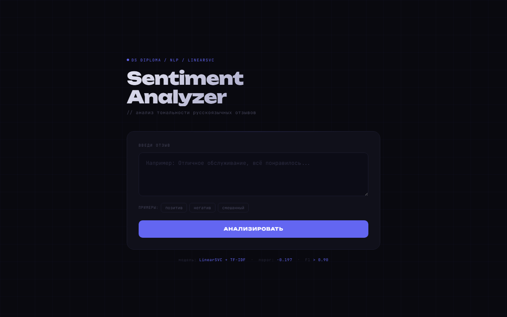

# Проект 6. Анализ тональности отзывов клиентов (Яндекс Карты)

**[Файл с решением (Jupyter Notebook)](https://github.com/sibainu2010/skillfactory_ds/blob/main/project_6/project_6.ipynb)**

**[Живое демо API](https://sentiment-api-tnbb.onrender.com)**

## Оглавление

[1. Описание проекта](#описание-проекта)

[2. Какой кейс решаем](#какой-кейс-решаем)

[3. Краткая информация о данных](#краткая-информация-о-данных)

[4. Этапы работы над проектом](#этапы-работы-над-проектом)

[5. Результат](#результат)

[6. Выводы](#выводы)

---

### Описание проекта

Задача — автоматически определять тональность отзывов с Яндекс Карт: позитивный или негативный. Это нужно, чтобы бизнес мог не читать вручную тысячи комментариев, а сразу получать приоритетный список жалоб для обработки.

В основе подхода — TF-IDF векторизация текста + LinearSVC с подобранным оптимальным порогом классификации. Данные реальные, отзывы пользователей Яндекс Карт за 2023 год, опубликованы как открытый датасет на Hugging Face.

---

### Какой кейс решаем

**Бизнес-задача:** имея исторические отзывы с Яндекс Карт, научиться автоматически определять тональность новых отзывов и реагировать на негатив в приоритетном порядке.

**Техническая задача:** построить модель бинарной классификации, предсказывающую тональность отзыва (положительный или отрицательный) на основе текста.

**Метрики качества:** F1-score и Accuracy — обе должны превышать 0.90.

**Что практикуем:** полный NLP-пайплайн — от сырого русскоязычного текста до задеплоенного REST API: лемматизация, TF-IDF, подбор гиперпараметров, SHAP-интерпретация, деплой на Render.

---

### Краткая информация о данных

- Отзывы реальных пользователей с Яндекс Карт за 2023 год
- Формат: Parquet
- 5 полей: адрес организации, название, рейтинг (1–5), рубрики деятельности, текст отзыва
- Дисбаланс классов: позитивных отзывов значительно больше, чем негативных
- Источник: открытый датасет на Hugging Face

---

### Этапы работы над проектом

**Этап 1. Знакомство с данными и базовая предобработка**

Изучена структура датасета с отзывами Яндекс Карт: 5 признаков, формат Parquet. Удалены дубликаты, пропусков нет. Рейтинг по шкале 1–5 переведён в бинарную метку: оценки 4–5 → позитив (1), оценки 1–2 → негатив (0), рейтинг 3 исключён как нейтральный.

**Этап 2. Разведочный анализ данных (EDA)**

Проанализировано распределение рейтингов, топ рубрик и городов по количеству отзывов. Выявлено: негативные отзывы в среднем длиннее позитивных — недовольный клиент объясняет подробнее. Облака слов показали чёткое разделение лексики между классами. Построена интерактивная карта уровня негатива по городам России через геокодирование.

Интерактивные Plotly-графики:
- [Топ-20 рубрик](https://sibainu2010.github.io/skillfactory_ds/project_6/rubrics.html)
- [Топ-15 городов](https://sibainu2010.github.io/skillfactory_ds/project_6/cities.html)
- [Рейтинг по рубрикам](https://sibainu2010.github.io/skillfactory_ds/project_6/rating_by_rubric.html)
- [Карта негатива по России](https://sibainu2010.github.io/skillfactory_ds/project_6/map.html)
- [Подбор порога F1](https://sibainu2010.github.io/skillfactory_ds/project_6/threshold.html)

**Этап 3. NLP-предобработка текста**

Реализована функция лемматизации и очистки: приведение к нижнему регистру, удаление всего кроме кириллицы, фильтрация стоп-слов (стандартный список NLTK расширен кастомными словами под разговорный стиль отзывов), лемматизация через pymorphy3. Слова «хожу», «ходил», «ходить» становятся одним токеном — это сокращает словарь и улучшает качество модели.

**Этап 4. Моделирование и подбор гиперпараметров**

Сравнивались шесть алгоритмов: LogisticRegression, LinearSVC, DecisionTree, RandomForest, XGBoost, CatBoost. TF-IDF матрица: 50 000 признаков, нграммы 1–3. Линейные методы показали лучший баланс качества и скорости на разреженных текстовых матрицах. Финальная модель — **LinearSVC** с `C=0.1`, `class_weight={0:5, 1:1}`.

Подбор гиперпараметров через GridSearchCV / RandomizedSearchCV на подвыборке из 20 000 примеров. Оптимальный порог классификации подобран на отдельной валидационной выборке (максимизация F1). Финальная оценка — однократно на тестовой выборке, которая не участвовала ни в обучении, ни в настройке порога.

**Этап 5. Интерпретация и деплой**

SHAP-анализ подтвердил логичность модели: слова с явной негативной окраской снижают предсказание, позитивные — повышают. Анализ ошибок показал, что модель ошибается преимущественно на «смешанных» отзывах — когда в одном тексте есть и похвала, и жалоба. Финальная модель сохранена и задеплоена как REST API (FastAPI + Render).

---

### Результат

Файл с итоговым решением:
[project_6.ipynb](https://github.com/sibainu2010/skillfactory_ds/blob/main/project_6/project_6.ipynb)

Живое демо API:
[https://sentiment-api-tnbb.onrender.com](https://sentiment-api-tnbb.onrender.com)

---

### Выводы

Задача бинарной классификации тональности русскоязычных отзывов с Яндекс Карт решена с метриками F1 > 0.90 и Accuracy > 0.90.

**По данным:** датасет оказался чистым — без пропусков, с небольшим количеством дубликатов. Главная сложность — дисбаланс классов, который учли через `class_weight` и `stratify`.

**По EDA:** самые активные категории — рестораны и сфера услуг. Негативные отзывы в среднем длиннее позитивных. Облака слов показали чёткое разделение лексики — задача решаема текстовыми методами.

**По моделям:** линейные методы (LogisticRegression, LinearSVC) на TF-IDF матрицах работают лучше бустингов по соотношению скорость/качество. Финальная модель — LinearSVC с оптимальным порогом классификации, подобранным независимо от теста.

**[к оглавлению](#оглавление)**
