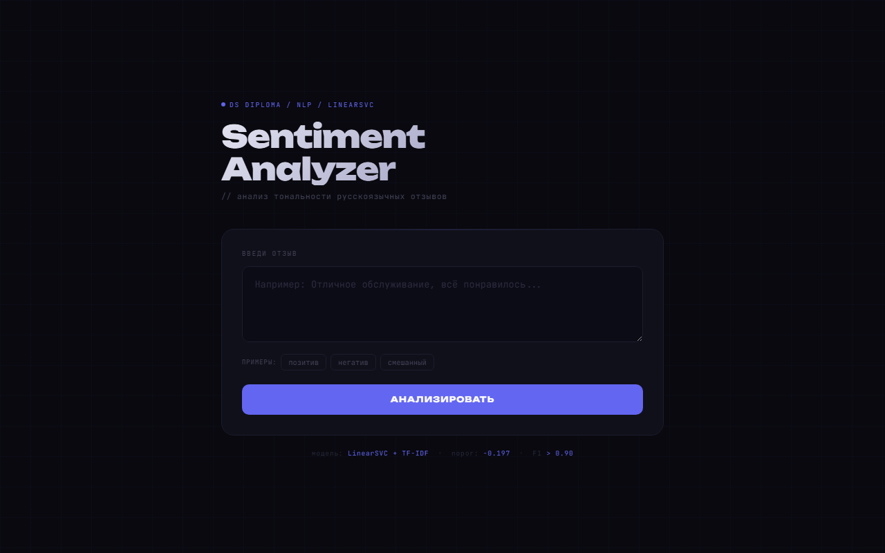

# Sentiment Analyzer API

REST API для анализа тональности русскоязычных отзывов. Часть [Проекта 6](https://github.com/sibainu2010/skillfactory_ds/blob/main/project_6/project_6.ipynb).

**[Живое демо](https://sentiment-api-tnbb.onrender.com)**

---

### Стек

- FastAPI — веб-фреймворк
- LinearSVC + TF-IDF — модель классификации
- pymorphy3 — лемматизация русского текста
- Render — деплой

### Модель

LinearSVC, обученная на отзывах с Яндекс Карт за 2023 год. Порог классификации -0.197 (подобран по F1). Метрики: F1 > 0.90, Accuracy > 0.90.

### Использование

```bash
curl -X POST https://sentiment-api-tnbb.onrender.com/predict \
  -H "Content-Type: application/json" \
  -d '{"text": "Отличное обслуживание, всё понравилось"}'
```

---


